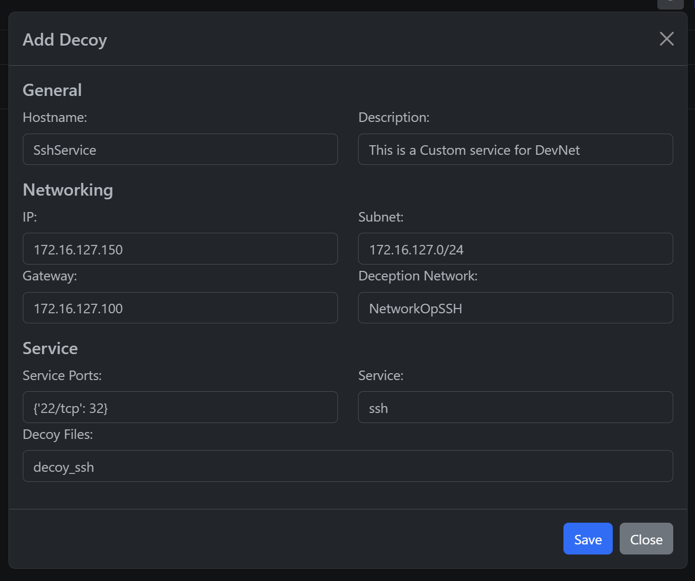

************************
Decoys Management
************************

.. contents:: Table of Contents

Decoy Deployment
-----------------------------
Inside every operation, every defined decoy is listed in a card with its configuration. 

Every decoy card has options to deploy in the configured docker env, start, stop or delete.

With the deployment of some of the decoys, the collector is deployed to start the log collection.

There are some additional controls to configure the docker env, delete the collector or delete the unused docker networks in the downside menu.

Decoy creation
-----------------------------

Using the "Add decoy", a modal is displayed to define the whole decoy configuration depending on the definitions for your operation.

- Hostname: The defined name of the decoy (For the operation and inside the container) - Ex: WebPrd01
- Description: Some notes for the decoy (For the operation) - Ex: This is a service for DevNet
- IP: Ipv4 used inside the container (It could be some of your protected env) - Ex: 172.16.127.150
- Subnet: Subnet for the container - Ex: 172.16.127.0/24
- Gateway: Gateway for the container - Ex: 172.16.127.100
- Deception Network: The isolated network in the Docker env (It could be shared between decoys) - Ex: NetworkOpWeb
- Service Ports: The exposed port in the Docker Host defined as a dictionary - Ex: {'22/tcp': 32}
- Service: The decoy type to be deployed (apache | mysql | ssh) - Ex: apache
- Decoy Files: The folder inside ./decoyfiles/ where you are going to place the configuration files to model your decoy - Ex: WebPrd01-files

Current supported decoy types
-----------------------------

When a decoy is created, a decoy type is selected. The current developed decoy types are the following, we are working to support different or custom ones soon.

- :apache:
	- Deploy decoys with a juicy web application. 

- :mysql:
	- Deploy decoys with an interesting DB engine. 

- :ssh:
	- Deploy decoys with a captivating SSH service.