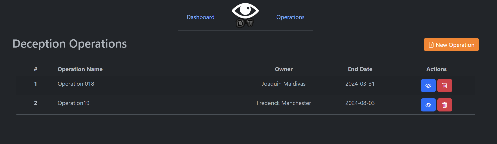
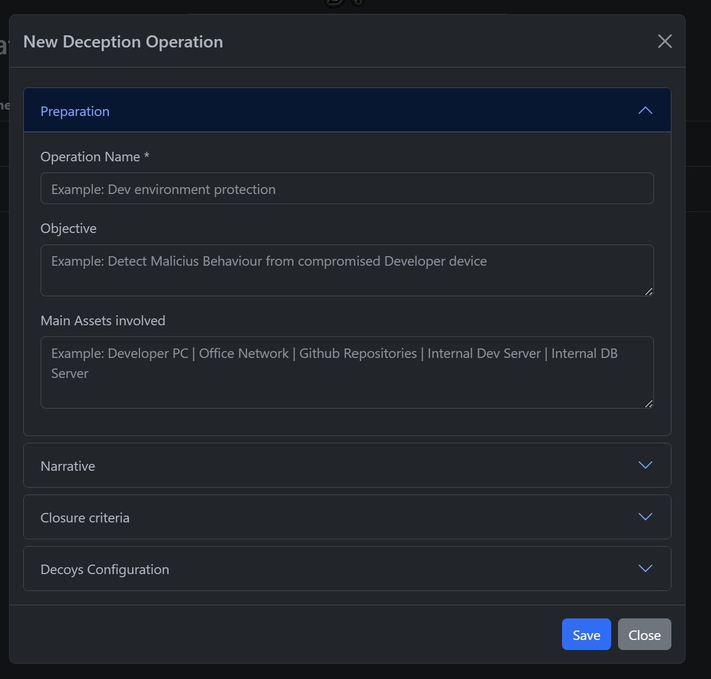

************************
Operations
************************

.. contents:: Table of Contents

Everything starts with an operation, it is composed of a series of iterative phases, each of which has a lifecycle that can be summarized in 4 stages: Planning, Deployment, Monitoring, and Lessons Learned.

Planning
------------------

- Objectives

A Deception Operation begins with the definition of the objectives, which should reflect the priorities and be expressed in concrete actions to measure and recognize progress, the objective can answer questions such as:

What is the adversary we are protecting against? 
You can choose and model it for example based on previous incidents, based on CTI or through specific TTPs that are current breaches of your defenses.

How do we want them to react and what do we want the adversary to perceive? 
We plan what the expected reactions will be and what kind of deception will be posed to the adversary. 
Reduce or increase the ambiguity, to remove him from a particular environment or to hinder the development of his attack.

- Main Assets involved

Related to the goals of the operation you can discover the main assets of the operation, those could be technical, like specific apps, servers, networks or nontechnical like a user, a role or a function.

This could be used to understand what's behind the operation.

Preparation 
--------------------

- Storytelling

In order to really engage the adversary, it is necessary to create a narrative, a general story to be presented. 
This storytelling is the core, the substance, behind the deception activities, it's a way to articulate everything.

Why this decoy is placed in this network?
Does it make sense that this web app could access to this decoy service?
Can we describe a story behind our deception op?
	
You can start with a simple sentence: "Joaquin, our Front Developer works with this Dev Server from the internal network and use some admin privileges to make changes in the server"

- Deception Activities

With the previous defined elements, you are ready to choose your deception activities. 

With DOLOST we can help you to deploy and manage decoys in an isolated network environments, every decoy service is exposed in a port in your docker env. Then you need to create NAT rules in your own networks to allow the decoy services to be presented as locally in the location that you planned.

It is recommended to incorporate another deception elements to the environment to support your narrative like breadcrumbs, honeytokens, useless information or any other. If you use some of them, you can document the usage with your operation to be aware of that.

- Limits

Every operation need to be defined in the boundaries of some definitions, the "Operation Commander" it's going to be the owner of the operation or the responsible for the definitions.

Over time, the engagement activities start to lose their value, this is why it's important to define an End Date and some ccriteria to "close the operation". 

For example: How we are going to proceed with a decoy after we detect some malicious behavior that correspond to an affected server in the network? 

Deployment
--------------------

When the plan is ready, you can dump every element in an operation in DOLOST. 

Prepare every decoy file to use during the deployment. 

Create the networking NAT rules to connect the protected network to the decoy.

Place the complement information, and deception elements. 

Monitor and Wait patiently...

Monitoring
--------------------

When you deploy a some decoy, a collector is deployed too to storage a lot of logs from those. These logs could be monitored locally in the Activity Dashboard, or you can configure an external Syslog to fordward and work with this externally.

Remember that the whole idea behind the monitored deception activities is to obtain accurate internal IoC.

Lessons Learned
-------------------------

Every operation is never alone, before finishing it, you need to extract some value for the improvement of the next operation.

This is why the planning and reports are so important, every cycle you can improve the story, the deception elements, or the location of the decoys in the environment.

