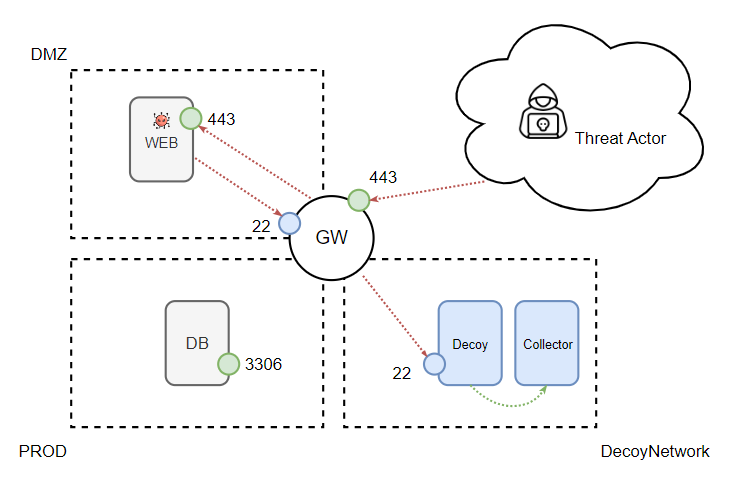
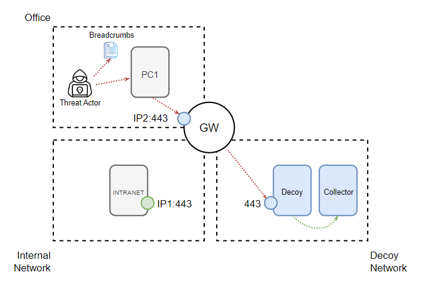
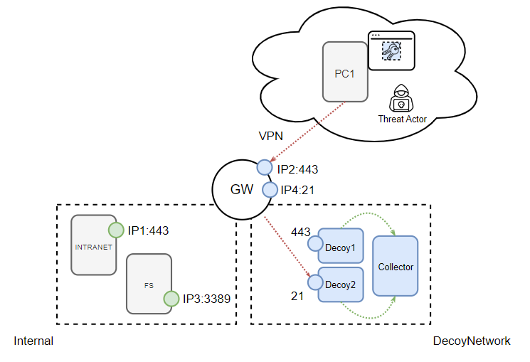

************************
Use cases
************************

.. contents:: Table of Contents

A *LIE* is only as good as the story behind it, here are some use cases to illustrate how you can deploy your environments. 

WebApp and Backend
============================

An application server located in a DMZ connects with various services on a production network to operate normally. Through DOLOST, a decoy is deployed containing an SSH service, and NAT rules are set up in the firewall for the same IP address as the internal service for port 22 (translating it to the decoy's address on the port where the SSH service is located). In this way, an attacker who takes control of the web application service, during their reconnaissance stage to perform lateral movement, will encounter a decoy service to interact with, and that interaction will be recorded in the collector.

Desktops and Internal Services
========================================

A workstation located on a network that has access to some internal service can be compromised by an attacker. The deployment of the solution allows for the instantiation of services similar to the internal services located at different IP addresses, posing, for example, as a development version of the intranet. Interacting with this service generates relevant indicators representing anomalous behavior. To support the narrative proposed by this operation, documents could be added to guide the threat actor to this decoy service. Among other scenarios to design and deploy, we could list, for example, authentication servers, other workstations, portals of relevant internal areas (e.g., HR, Finance).

VPN Access
====================

In an environment with VPN-type connections, decoys can be deployed that offer a set of relevant services, in conjunction with internal services. In this way, an attacker located on a remote device that gains access via VPN will have only a few chances to connect to the valid service without leaving traces. This narrative could be supported by honeytoken-type credentials planted in the browsers of remote workstations that point to these services with realistic credentials.

