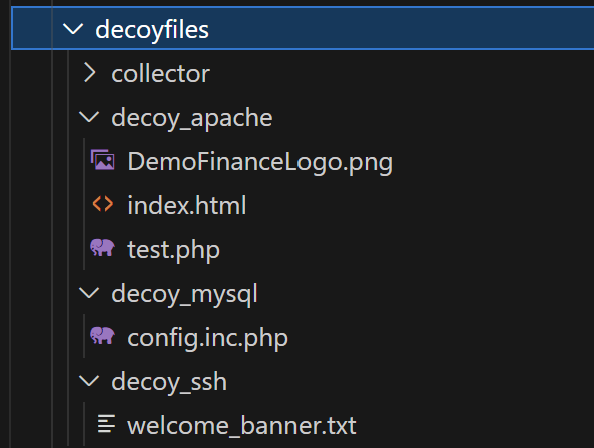

DecoyFiles
====================

DecoyFiles is the repository where you are going to locate the Files that are going to be used in the decoy containers.

Those files are going to model the corresponding decoy to accomplish the goals of the operation.

Every type of decoy can store a different type of files to modulate your decoy to be realistic.

Current supported decoy files
-----------------------------

- :DecoyFiles for Apache:
	- If you are using "apache" as a decoy type, you can upload your own website (HTML / CSS / JS Files).

- :DecoyFiles for MySQL:
	- If you are using "mysql" as a decoy type, you can upload your own db configuration (Example, PHPMyAdmin).

- :DecoyFiles for SSH:
	- If you are using "SSH" as a decoy type, you can upload your own SSH banner.

