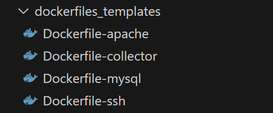

DockerFiles Templates
==============================

On the dockerfiles_templates, the recipe for the creation of every decoy its stored. 

In these files, some customizations could be made to align the decoys to your environment, every template its related to an specific supported decoy type.

