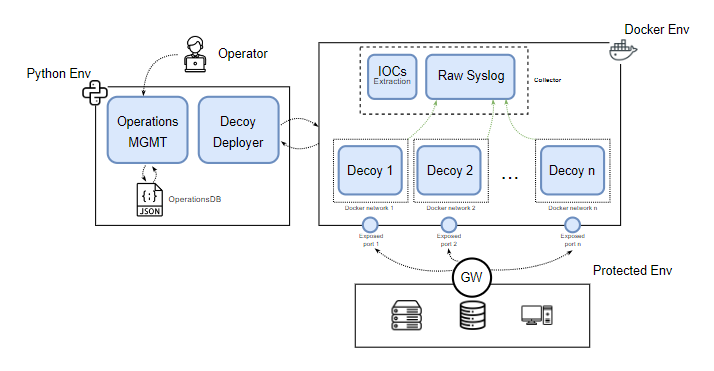

**********************************************************
DOLOST
**********************************************************

.. contents:: Table of Contents

DOLOS-T is an orchestration platform for cyber deception operations that allows the deployment of realistic decoys and services with high and medium interaction to detect threats in the operational infrastructure. 

It can be deployed in a remote or local environment, and through various network traffic redirections, it allows the services to appear to be deployed locally. 

It enables the implementation of deception strategies even in critical production environments with an acceptable level of risk and exposure.

The goal is to create complex and realistic environments to detect the target as a decoy. The main strategy is not to hide the service as a decoy, but to detect anomalous behavior early within the environment.

Features
=========

* Creation of objects that model the goals, storytelling, and context for cyber deception operations and define decoy services with realistic information.
* Automated deployment of decoys with fake user-provided data to create confusion, increase ambiguity, and detect attackers early.
* Dynamic environments generation that can be easily deployed, discarded, or redefined.
* Centralized log collection to monitor decoy usage activity
* IOCs from collected logs for attacker engagement
* Guidance panel to track operations design, definitions, and decisions, which helps define and manage the operations lifecycle based on a simplified methodology.
* First open source tool of its kind.

Schematic
==========

.. toctree::
   :caption: DOLOST
   :maxdepth: 1
   :hidden:

   Usecases
   Operations
   Decoymanagement
   Usage

.. toctree::
   :caption: DOLOST Package
   :maxdepth: 4
   :hidden:

   core/app
   core/cli
   core/context
   services/services
   blueprints/blueprints

.. toctree::
   :caption: Decoys development
   :maxdepth: 1
   :hidden:

   core/dockerfiles_templates
   core/decoyfiles