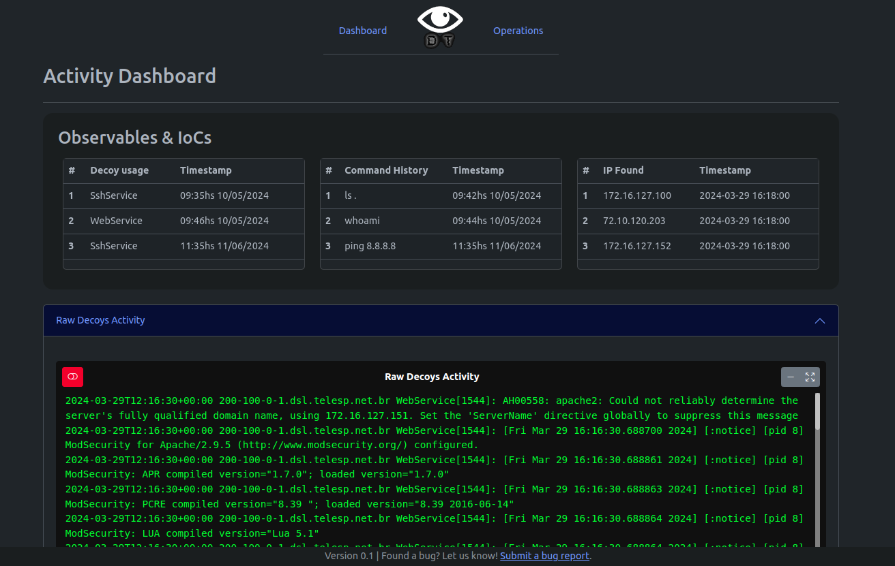
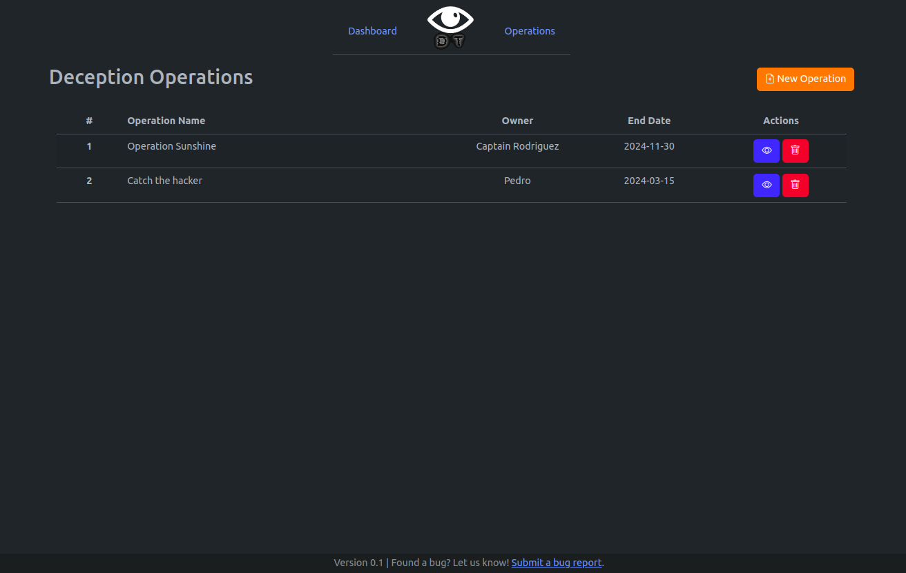
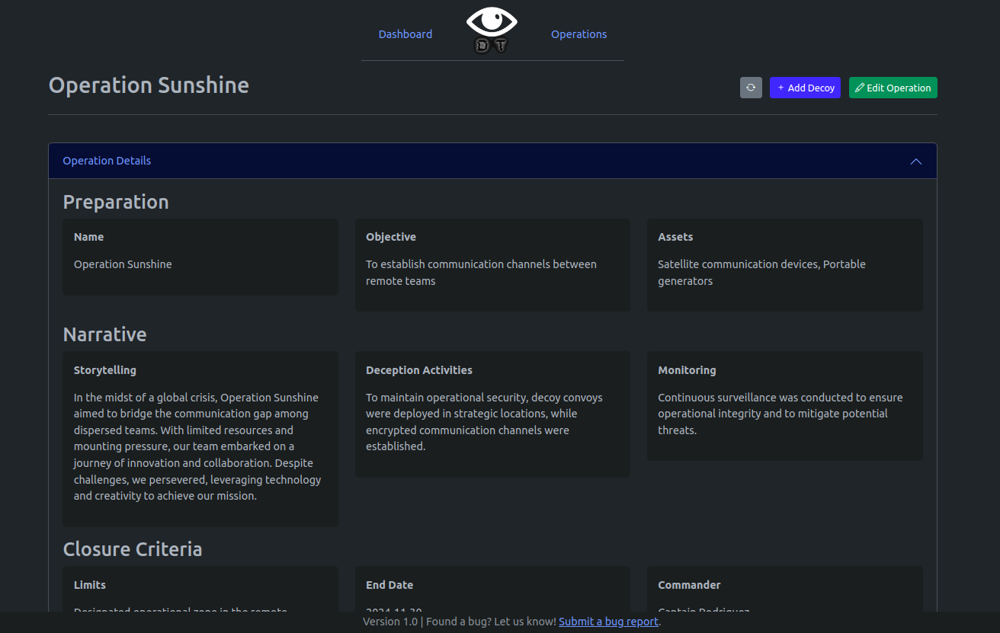
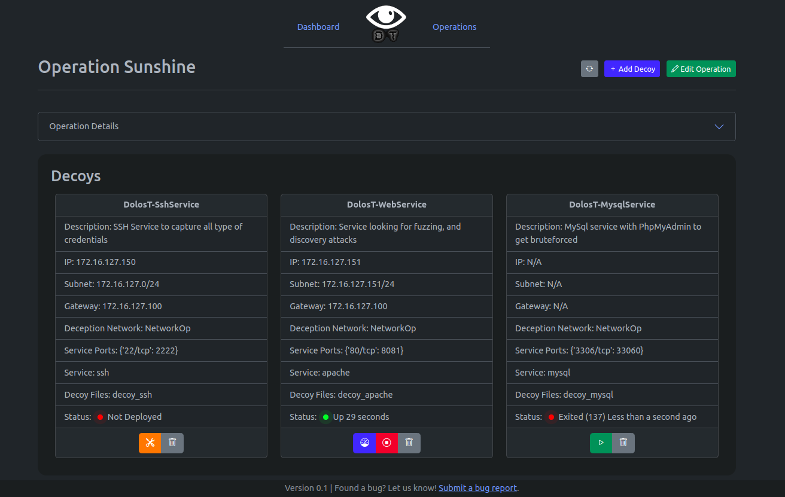
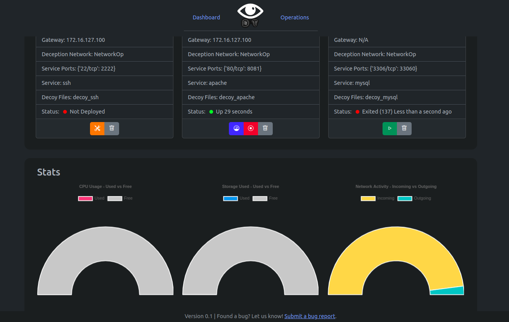
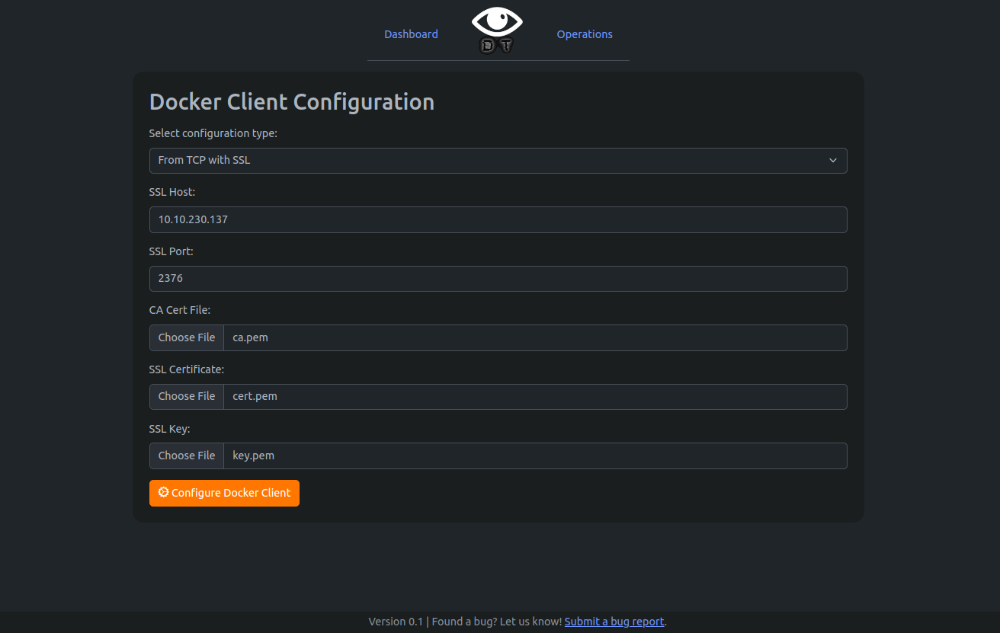
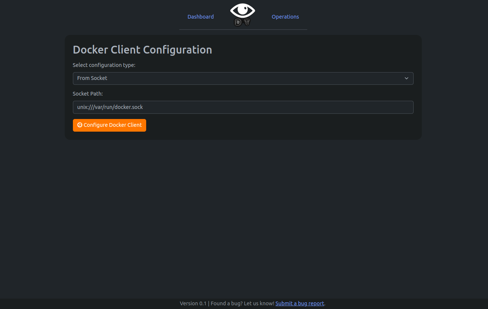

# DOLOST Framework Examples

This folder contains captures of the GUI, an example Python script to run the framework, and a mockup Operations Database.

## Getting Started

To begin exploring the capabilities of DOLOST, start by examining the examples provided in this folder.

### Using the Python Package

To run the GUI, execute the `runme.py` script using Python:

This script is configured to access the Docker API from the current environment. Therefore, ensure that the user executing this script has the necessary permissions to run Docker commands.

Here is the content of the script:

```python
#!/usr/bin/python3
import DOLOST

docker_client = {'from_env': True}

if __name__ == "__main__":
    DOLOST.start(verbosity="INFO", docker_client=docker_client)
```

### Using the CLI

If you prefer to use DOLOST directly from the command line interface (CLI), you can easily do so!

Here is an example:

```bash
$ DOLOST --docker-client env --verbosity INFO
```

Or, for example, using Docker via TCP:

```bash
$ DOLOST --host 127.0.0.1 --port 8000 --docker-client tcp --tcp-host 10.20.112.102 --tcp-port 1234 --verbosity DEBUG
```

## Using the GUI

The GUI provides a comprehensive interface for managing decoys and operations.

- **Dashboard**: Provides an overview of IOCs and interactions with decoys.
  

- **Operations**: Allows the creation and management of operations.
  

- **Operations Viewer**: Displays detailed information about a selected operation.
  

- **Decoys Manager**: Enables the management of decoys, including deployment, starting, stopping, and removal.
  

- **Decoys Stats**: Displays real-time statistics of decoy containers, including CPU and network usage.
  

- **Docker Client Configuration**: Allows modification of the Docker client's configuration directly from the GUI.
  - **Using SSL**:
    
  - **Using a Socket**:
    

For detailed documentation and additional information about the DOLOST framework, please refer to the DOLOST documentation page.